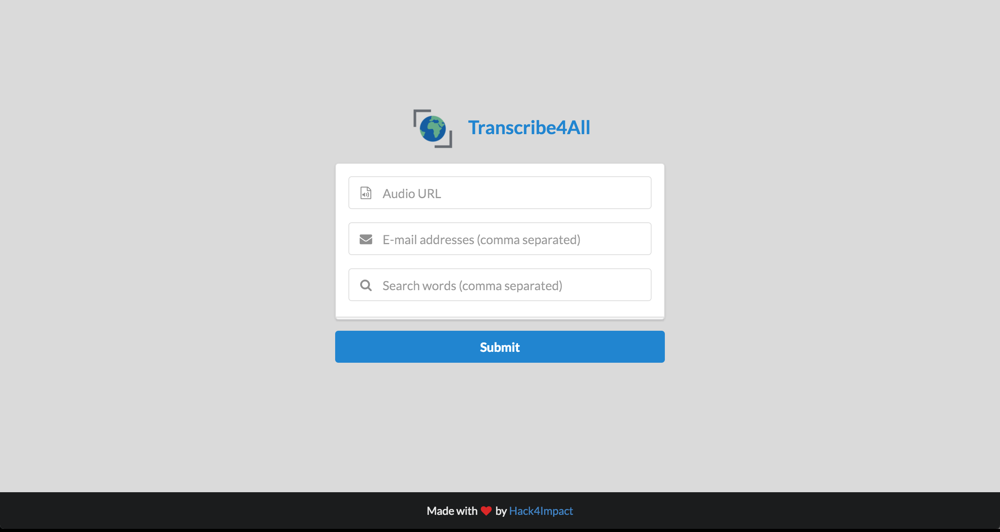
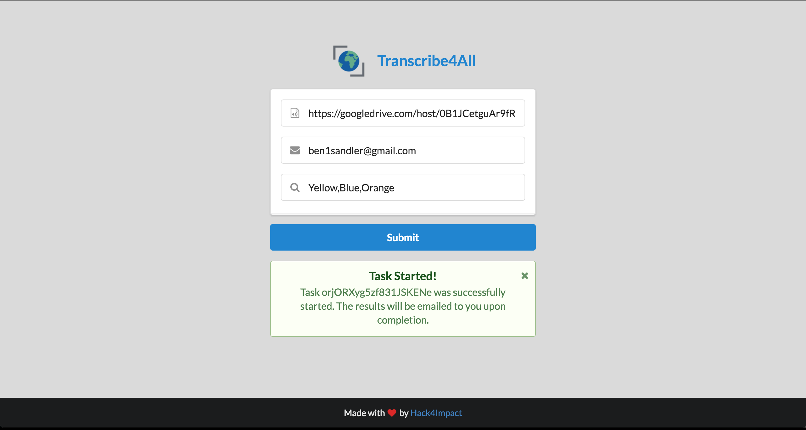

# transcribe4all [](https://travis-ci.org/hack4impact/transcribe4all) [](https://godoc.org/github.com/hack4impact/transcribe4all)

##### transcribe4all is a self-hosted web application for painless speech-to-text transcription of audio files.




## Install

```
$ go get github.com/hack4impact/transcribe4all
$ cd $GOPATH/src/github.com/hack4impact/transcribe4all
```
To set up Sphinx for transcription read the following [instructions.](Sphinx/README.md)

## Dependency management

If you add new dependencies to the app, run

```
$ godep save ./...
```

## Configuration

The app looks for a file named `config.toml` in the current directory. The file should look something like this:

```toml
BackblazeAccountID = ""
BackblazeApplicationKey = ""
BackblazeBucket = ""
Debug = true
EmailUsername = "user@gmail.com"
EmailPassword = ""
EmailSMTPServer = "smtp.gmail.com
EmailPort = 587
IBMUsername = ""
IBMPassword = ""
MongoURL = ""
Port = 8080
SecretKey = ""
```

* Supply your [Backblaze](https://www.backblaze.com/b2/cloud-storage.html) credentials to store audio files in the cloud after transcription is complete. [Or leave empty.]
* Set `Debug` to `true` if you want extra verbose log messages.
* Supply email credentials so that the app can email users when transcription is successful or fails. [Or leave empty.]
* Supply your [IBM Speech-To-Text](http://www.ibm.com/watson/developercloud/speech-to-text.html) credentials in order to transcribe audio files using the IBM Watson Speech-To-Text API.
* Supply your [MongoDB](https://www.mongodb.com/) instance url to store transcription information (such as timestamps, confidence, and keywords).
* Set `SecretKey` to a random string. You can generate one [here](http://randomkeygen.com/).

## Run the app

```
$ go build
$ ./transcribe4all
```

## How to use the app

1. Navigate to the app's index page at http://localhost:8080 (substitute 8080 for the port).
2. Enter the url of the audio file.
3. Enter a comma-separated list of all the email addresses which should be notified when transcription is complete.
4. Enter a comma-separated list of all keywords to listen for in the audio.

## License
[MIT License](LICENSE.md)
